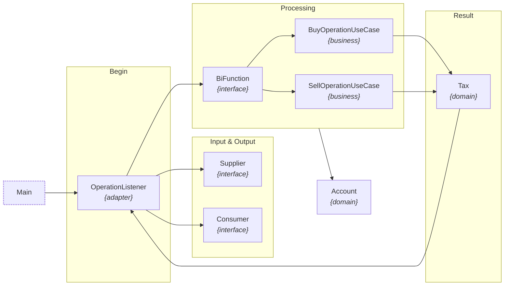

[](https://nubank.com.br)
[](https://www.linkedin.com/in/petersonolbi)
[](https://eclipseide.org)
[](https://www.jetbrains.com/idea)
[](https://github.com/petersonolbi/code-challenge_capital-gain/actions/workflows/gradle.yml)
[](https://app.codacy.com/gh/petersonolbi/code-challenge_capital-gain/dashboard?utm_source=gh&utm_medium=referral&utm_content=&utm_campaign=Badge_grade)
[](https://sonarcloud.io/summary/new_code?id=code-challenge_capital-gain)
[](https://github.com/petersonolbi/code-challenge_capital-gain/commits/main)
[](LICENSE)
[](https://sonarcloud.io/summary/new_code?id=code-challenge_capital-gain)
[](https://sonarcloud.io/summary/new_code?id=code-challenge_capital-gain)
[](https://github.com/petersonolbi/code-challenge_capital-gain)

## Code Challenge: Capital Gain

This project implements the Capital Gains challenge ([*described here*](https://github.com/petersonolbi/code-challenge_capital-gain/blob/main/spec-ptbr.pdf)), processing buy and sell transactions and calculating taxes according to specific rules. The solution prioritizes precision by using `BigDecimal` and functional programming with `BiFunction`, while maintaining a clear separation between the domain and business rules.

📥**Input & Output**

```json
[{"operation":"buy","unit-cost":1,"quantity":1},{"operation":"sell","unit-cost":1,"quantity":1}]
```
```json
[{"tax":0.00},{"tax":0.00}]
```

## ⚡️Run the project
Below are instructions for running the project.

1. **Install [JDK 21](https://www.oracle.com/java/technologies/downloads)**: _To validate the installation, open the command line and type: `java --version`._
2. _Navigate to the project root folder._
3. **Run the Capital Gain**: _Open the command line and type: `gradlew run`._

🧩 **Dependencies:**
1. _[**GSON**](https://github.com/google/gson): JSON serialization._
3. _[**JUnit 5**](https://junit.org/junit5): unit testing._
4. _[**Mockito**](https://site.mockito.org): mocking framework._
5. _[**Project Lombok**](https://projectlombok.org) boilerplate reduction._

## 👨‍🎓 About the Architecture

In the architecture of this project, I chose to avoid directly coupling business rules to domain classes. Although I understand the points raised by [Martin Fowler in the article "Anemic Domain Model"](https://martinfowler.com/bliki/AnemicDomainModel.html), in most of my projects I tend to centralize rules within specific business classes. As previously mentioned, I used the `BigDecimal` type to represent monetary values, which added an extra layer of complexity.
Finally, the rules for each operation were isolated into two classes: `BuyOperationUseCase` and `SellOperationUseCase`:



> **Attention** the `OperationListenerTest` class runs tests for all scenarios presented in the challenge documentation.

- The application flow begins with the `Main` class, which is responsible for configuring the initial context and instantiating the available operation types.
- As can be seen in the `OperationListener` class constructor, data input and output are defined through [Java](https://www.oracle.com/java/technologies/downloads)'s functional interfaces, exploiting the functional programming capabilities offered by the language.
- The `OperationListener` class then acts as a listener, purposefully simulating the behavior of an event queue.
- This listener invokes implementations of the `BiFunction<Account, Operation, Tax>` interface, which are responsible for applying tax rules based on the operation type.
- It's worth noting that the `Account` class is intentionally modified by reference during operation processing, a deliberate breach of the concept of immutability.