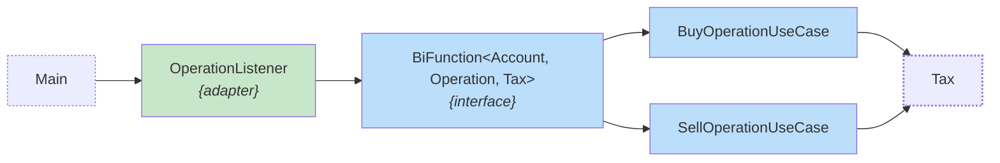

## Code Challenge: Capital Gain

I tried to keep the challenge as lean as possible, without imposing rules on the input fields, working with `BigDecimal` to ensure accuracy in monetary values.

```json
[{"operation":"buy","unit-cost":1,"quantity":1},{"operation":"sell","unit-cost":1,"quantity":1}]
[{"tax":0.00},{"tax":0.00}]
```

## ⚡️Run the project
Below are instructions for running the project.

1. **Install [JDK 21](https://www.oracle.com/java/technologies/downloads)**: _To validate the installation, open the command line and type: `java --version`._
2. _Navigate to the project root folder._
3. **Run the Capital Gain**: _Open the command line and type: `./gradlew run`._

**Dependencies:**
1. _[**GSON**](https://github.com/google/gson): Library to work with JSON._
3. _[**JUnit 5**](https://junit.org/junit5): Unit testing framework._
4. _[**Mockito**](https://site.mockito.org): Unit testing framework._
5. _[**Project Lombok**](https://projectlombok.org) Library that automatically connects to your editor and creates tools to "spice up" Java._

## 👨‍🎓 A little about the architecture

In this project's architecture, I chose to avoid coupling business rules directly to domain classes. While I understand the points raised by [Martin Fowler in the article "Anemic Domain Model"](https://martinfowler.com/bliki/AnemicDomainModel.html) in most of my projects I tend to concentrate the rules in specific business classes.
As mentioned, I used the `BigDecimal` type extensively to represent monetary values, which added an extra layer of complexity.  
Last but not least, the rules for each operation were isolated into two classes: `BuyOperationUseCase` and `SellOperationUseCase`:



> **Attention** to the `OperationListenerTest` class, which performs tests for all scenarios presented in the challenge documentation.

- The application flow begins with the `Main` class, which is responsible for configuring the initial context and instantiating the available operation types.  
  The `OperationListener` class then acts as a listener, purposefully simulating the behavior of an event queue or topic consumer.
  This listener invokes implementations of the `BiFunction<Account, Operation, Tax>` interface, which are responsible for applying tax rules based on the operation type.
- It's worth noting that the `Account` class is intentionally modified by reference during operation processing—a deliberate breach of the concept of immutability.
- As can be seen in the `OperationListener` class constructor, data input and output are defined through [Java](https://www.oracle.com/java/technologies/downloads)'s functional interfaces, extensively exploiting the functional programming capabilities offered by the language.